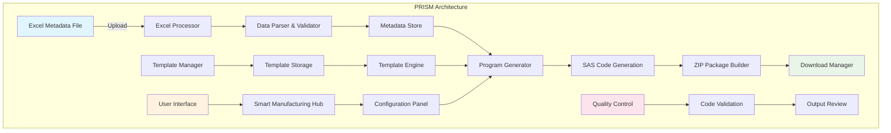
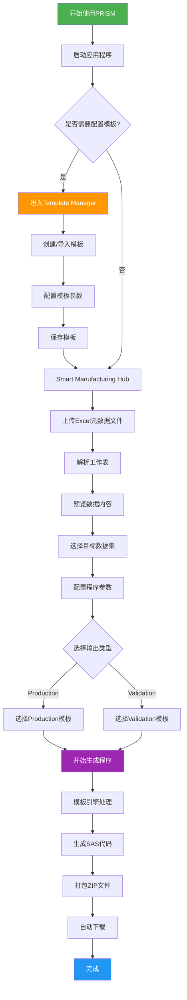

# PRISM

**Platform for Research Infrastructure Smart Manufacturing**

🔬 **智能化临床研究代码生成平台** | 专为SDTM、ADaM数据集和TLF报告设计

[](https://github.com/your-repo/prism-platform)
[](LICENSE)
[](https://vuejs.org/)
[](https://www.typescriptlang.org/)

## 🚀 项目概述

PRISM是一个现代化的Web应用程序，旨在标准化和自动化临床研究中的程序生成流程。通过智能模板引擎和直观的用户界面，PRISM能够将Excel元数据文件转换为标准化的SAS程序，大幅提升开发效率和代码质量。

### ✨ 核心特性

- 🎯 **智能代码生成** - 基于Excel元数据自动生成Production和Validation程序
- 📊 **多数据类型支持** - 全面支持SDTM、ADaM数据集和TLF报告
- 🔧 **灵活模板系统** - 支持自定义模板的创建、编辑和管理
- 📱 **现代化界面** - 基于Vue 3的响应式用户界面
- 🔄 **批量处理** - 支持多工作表和批量程序生成
- 💾 **本地存储** - 模板和配置信息安全存储在本地
- 🌐 **跨平台兼容** - 支持Windows、macOS和Linux

## 🏗️ 系统架构



## 📁 项目结构

```
prism/
├── .github/                 # GitHub 配置和工作流
│   └── agents/             # GitHub Copilot 代理配置
├── .vscode/                # VS Code 编辑器配置
├── public/                 # 静态资源文件
│   ├── references/         # 参考文档和示例
│   ├── templates/          # 预置代码模板
│   ├── prism-logo.svg      # 项目Logo
│   ├── vite.svg            # Vite图标
│   ├── .nojekyll           # GitHub Pages配置
│   └── 404.html            # 404错误页面
├── server/                 # 后端服务器
│   ├── uploads/            # 文件上传临时目录
│   ├── server.js           # Express服务器主文件
│   ├── package.json        # 服务器依赖配置
│   └── .env                # 服务器环境变量配置
├── src/                    # 前端源代码
│   ├── assets/             # 资源文件（图片、样式等）
│   ├── components/         # Vue组件
│   │   ├── TemplateManager.vue           # 模板管理器组件
│   │   ├── SASCodeEditor.vue             # SAS代码编辑器组件
│   │   ├── ServerConnectionDialog.vue    # 服务器连接对话框
│   │   ├── ServerFileBrowser.vue         # 服务器文件浏览器
│   │   ├── TemplateSelectionDialog.vue   # 模板选择对话框
│   │   └── FileConflictDialog.vue        # 文件冲突处理对话框
│   ├── services/           # 业务逻辑服务
│   │   ├── types/          # TypeScript类型定义
│   │   │   ├── adam.d.ts   # ADaM数据类型定义
│   │   │   └── jszip.d.ts  # JSZip类型定义
│   │   ├── ExcelProcessor.ts              # Excel文件解析服务
│   │   ├── ProgramGenerator.ts            # 程序生成服务
│   │   ├── ReferenceTemplateService.ts    # 参考模板服务
│   │   ├── ServerFileManager.ts           # 服务器文件管理服务
│   │   ├── MockServerAPI.ts               # 模拟服务器API
│   │   └── TemplateStorageService.ts      # 模板存储服务
│   ├── stores/             # 状态管理（Pinia）
│   │   └── templateStore.ts               # 模板状态管理
│   ├── utils/              # 工具函数
│   │   └── environment.ts                 # 环境配置工具
│   ├── App.vue             # 根Vue组件
│   ├── main.ts             # 应用入口文件
│   └── vite-env.d.ts       # Vite环境类型定义
├── index.html              # HTML入口文件
├── demo.html               # 演示页面
├── package.json            # 项目依赖和脚本配置
├── package-lock.json       # 依赖版本锁定文件
├── vite.config.ts          # Vite构建配置
├── tsconfig.json           # TypeScript基础配置
├── tsconfig.app.json       # TypeScript应用配置
├── tsconfig.node.json      # TypeScript Node环境配置
├── .gitignore              # Git忽略文件配置
├── README.md               # 项目说明文档
├── CHANGELOG.md            # 变更日志
├── DEPLOYMENT.md           # 部署指南
├── PRODUCTION_DEPLOYMENT.md # 生产环境部署指南
├── BRANCH_DEPLOYMENT.md    # 分支部署指南
├── DEPLOYMENT_TROUBLESHOOTING.md # 部署故障排除
├── GITHUB_PAGES_FIX.md     # GitHub Pages修复指南
├── TROUBLESHOOTING.md      # 故障排除指南
└── RELEASE_NOTES.md        # 版本发布说明
```

### 核心目录说明

#### `/src` - 前端源代码
包含所有前端应用的源代码，采用Vue 3 + TypeScript开发。

- **`/src/components`** - Vue组件库
  - 所有可重用的UI组件
  - 包含模板管理、代码编辑、文件浏览等核心功能组件

- **`/src/services`** - 业务逻辑层
  - `ExcelProcessor.ts` - 处理Excel文件的解析和验证
  - `ProgramGenerator.ts` - 负责根据模板生成SAS程序
  - `TemplateStorageService.ts` - 管理模板的本地存储
  - `ServerFileManager.ts` - 处理服务器文件操作
  - `ReferenceTemplateService.ts` - 管理预置参考模板

- **`/src/stores`** - 状态管理
  - 使用Pinia进行全局状态管理
  - `templateStore.ts` - 管理模板相关的全局状态

- **`/src/utils`** - 工具函数
  - 通用工具函数和辅助方法
  - 环境配置和变量管理

#### `/public` - 静态资源
存放不需要编译处理的静态文件。

- **`/public/templates`** - 预置模板文件
  - 包含默认的SAS程序模板
  - 用于快速开始和参考

- **`/public/references`** - 参考文档
  - 示例文件和使用指南
  - 帮助文档和最佳实践

#### `/server` - 后端服务
基于Express.js的Node.js后端服务。

- **`server.js`** - 主服务器文件
  - 提供文件上传API
  - SFTP连接管理
  - 文件浏览和操作接口

- **`/server/uploads`** - 上传临时目录
  - 存储通过API上传的临时文件
  - 自动清理机制

#### 配置文件

- **`vite.config.ts`** - Vite构建工具配置
  - 开发服务器设置
  - 构建优化选项
  - 插件配置

- **`tsconfig.*.json`** - TypeScript编译配置
  - `tsconfig.json` - 基础配置
  - `tsconfig.app.json` - 应用代码配置
  - `tsconfig.node.json` - Node.js环境配置

- **`package.json`** - 项目配置
  - 依赖管理
  - 脚本命令
  - 项目元数据

### 文件组织规范

#### 组件命名
- Vue组件使用PascalCase命名：`TemplateManager.vue`
- 组件文件名与组件名保持一致

#### 服务文件命名
- 服务类使用PascalCase + 描述性后缀：`ExcelProcessor.ts`
- 一个文件对应一个主要服务类

#### 类型定义
- 类型定义文件使用`.d.ts`扩展名
- 存放在`src/services/types/`目录下

#### 样式组织
- 全局样式放在`src/assets/`目录
- 组件特定样式写在组件的`<style>`标签内

## 📋 使用流程



## 🛠️ 快速开始

### 环境要求

- **Node.js** >= 18.0.0
- **npm** >= 8.0.0 或 **yarn** >= 1.22.0
- **现代浏览器** (Chrome 90+, Firefox 88+, Safari 14+, Edge 90+)

### 安装步骤

1. **克隆项目**
   ```bash
   git clone https://github.com/your-repo/prism-platform.git
   cd prism-platform
   ```

2. **安装依赖**
   ```bash
   npm install
   # 或者使用 yarn
   yarn install
   ```

3. **启动开发服务器**
   ```bash
   npm run dev
   # 或者使用 yarn
   yarn dev
   ```

4. **访问应用**
   
   打开浏览器访问 `http://localhost:5173`

### 构建生产版本

```bash
# 构建生产版本
npm run build

# 预览生产版本
npm run preview
```

## 📚 详细使用指南

### 1. 准备Excel元数据文件

PRISM支持以下Excel文件格式的元数据：

#### SDTM/ADaM数据集格式
| Dataset | Program | Programmer | QC Program | QC Programmer |
|---------|---------|------------|------------|---------------|
| ADSL    | adsl.sas| John Doe   | v_adsl.sas | Jane Smith    |
| ADAE    | adae.sas| John Doe   | v_adae.sas | Jane Smith    |

#### TLF报告格式
| Output Type | Output # | Title | Output Name | Program Name | Programmer | QC Program | QC Programmer |
|-------------|----------|-------|-------------|--------------|------------|------------|---------------|
| Table       | 14.1.1   | Demographics | t-14-1-1.rtf | t_14_1_1.sas | John Doe | v_t_14_1_1.sas | Jane Smith |
| Listing     | 16.2.1   | Adverse Events | l-16-2-1.rtf | l_16_2_1.sas | John Doe | v_l_16_2_1.sas | Jane Smith |

### 2. 模板管理

#### 创建新模板
1. 点击 **Template Manager** 标签
2. 选择 **Create New Template**
3. 配置模板信息：
   - **名称**：为模板命名
   - **类型**：Production/Validation/Custom
   - **描述**：简要说明模板用途
4. 编写模板代码（支持占位符变量）
5. 保存模板

#### 模板变量系统
PRISM支持以下占位符变量：

```sas
/* 基础变量 */
{{DATASET_NAME}}     /* 数据集名称 */
{{PROGRAM_NAME}}     /* 程序名称 */
{{PROGRAMMER}}       /* 程序员姓名 */
{{OUTPUT_TYPE}}      /* 输出类型 */

/* TLF专用变量 */
{{OUTPUT_NUMBER}}    /* 输出编号 */
{{OUTPUT_TITLE}}     /* 输出标题 */
{{OUTPUT_NAME}}      /* 输出文件名 */

/* 时间戳变量 */
{{CURRENT_DATE}}     /* 当前日期 */
{{CURRENT_TIME}}     /* 当前时间 */
{{TIMESTAMP}}        /* 完整时间戳 */
```

### 3. 程序生成流程

#### 步骤1：上传元数据
- 点击上传区域或拖拽Excel文件
- 系统自动解析工作表
- 预览数据内容

#### 步骤2：数据选择
- 浏览解析的数据表格
- 选择需要生成程序的数据集
- 切换不同工作表（如有）

#### 步骤3：配置参数
- 选择输出类型（Production/Validation）
- 选择对应的代码模板
- 确认生成设置

#### 步骤4：生成下载
- 点击"Generate Programs"按钮
- 自定义ZIP文件名称
- 等待生成完成
- 自动下载ZIP包

## 🔧 配置说明

### 项目配置文件

#### `vite.config.ts`
```typescript
import { defineConfig } from 'vite'
import vue from '@vitejs/plugin-vue'
import legacy from '@vitejs/plugin-legacy'

export default defineConfig({
  plugins: [
    vue(),
    legacy({
      targets: ['defaults', 'not IE 11']
    })
  ],
  server: {
    port: 5173,
    open: true
  },
  build: {
    outDir: 'dist',
    sourcemap: false
  }
})
```

#### `package.json` 脚本说明
```json
{
  "scripts": {
    "dev": "启动开发服务器",
    "build": "构建生产版本",
    "preview": "预览构建结果",
    "type-check": "TypeScript类型检查"
  }
}
```

## 🏭 核心技术栈

### 前端框架
- **Vue 3** - 渐进式JavaScript框架
- **TypeScript** - 带类型的JavaScript超集
- **Vite** - 下一代前端构建工具

### 数据处理
- **SheetJS/xlsx** - Excel文件解析库
- **JSZip** - ZIP文件生成库
- **FileSaver** - 文件下载库

### 状态管理
- **Pinia** - Vue官方状态管理库

### 开发工具
- **Vue Router** - 官方路由管理器
- **Vue TSC** - Vue TypeScript编译器

## 🔍 故障排除

### 常见问题

#### Q: Excel文件上传失败
**A:** 检查文件格式是否为.xlsx或.xls，确认文件未损坏且包含有效数据。

#### Q: 模板变量未正确替换
**A:** 确认模板中使用正确的占位符语法：`{{VARIABLE_NAME}}`

#### Q: 生成的程序下载失败
**A:** 检查浏览器下载设置，确认允许从此网站下载文件。

#### Q: 界面显示异常
**A:** 清除浏览器缓存，刷新页面重试。

### 调试模式

启用开发模式进行调试：
```bash
npm run dev
```

打开浏览器开发者工具查看控制台输出。

## 🚧 开发路线图

### 版本 2.1.0 (计划中)
- [ ] 支持R语言程序生成
- [ ] 增加Python脚本模板
- [ ] 实现模板分享功能
- [ ] 添加程序质量检查

### 版本 2.2.0 (规划中)
- [ ] 云端模板同步
- [ ] 团队协作功能
- [ ] 程序版本控制
- [ ] API接口开放

## 🤝 贡献指南

我们欢迎社区贡献！请遵循以下步骤：

1. Fork 项目仓库
2. 创建功能分支 (`git checkout -b feature/AmazingFeature`)
3. 提交更改 (`git commit -m 'Add some AmazingFeature'`)
4. 推送分支 (`git push origin feature/AmazingFeature`)
5. 开启 Pull Request

### 代码规范
- 使用TypeScript编写代码
- 遵循Vue 3 Composition API最佳实践
- 添加适当的注释和文档
- 确保通过所有测试

## 📄 许可证

本项目采用 MIT 许可证 - 查看 [LICENSE](LICENSE) 文件了解详情。

## 🙋‍♂️ 支持与反馈

- **技术支持**: 创建 [GitHub Issue](https://github.com/your-repo/prism-platform/issues)
- **功能建议**: 提交 [Feature Request](https://github.com/your-repo/prism-platform/issues/new?template=feature_request.md)
- **安全问题**: 发送邮件至 security@yourcompany.com

---

<div align="center">

**PRISM - 让临床研究代码生成更智能、更高效**

Made with ❤️ by Clinical Programming Team

</div>
